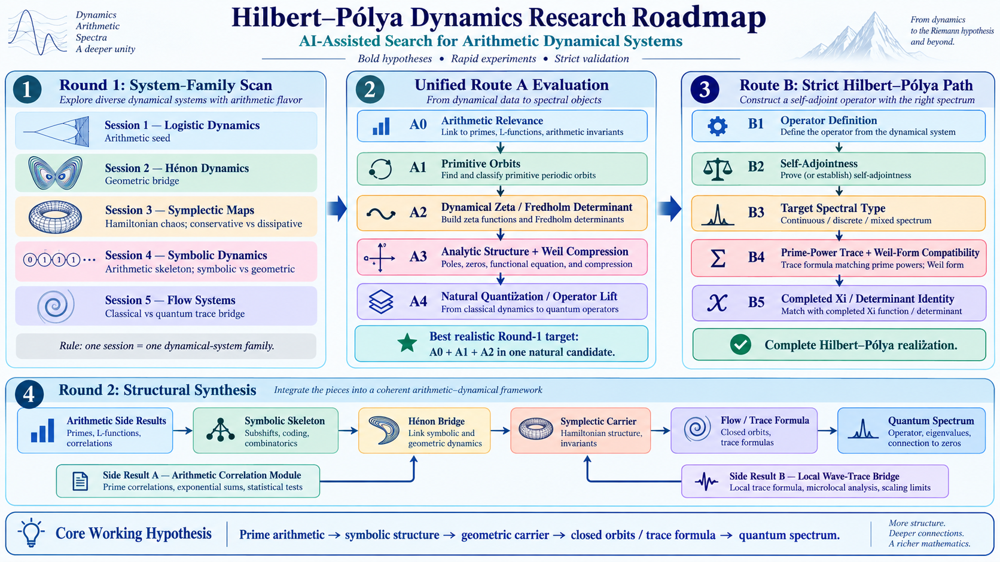

# Arithmetic Symplectic Flow

> **Round 2 — Candidate Engineering / Structural Synthesis**
> **Current state (2026-09-13):** planning workspace initialized. No concrete
> candidate has been frozen, no A0/A1/A2 gate has passed, and no Route B
> evaluation has been invoked.

## One-sentence mission

Construct and audit **one explicitly frozen suspension flow over a concrete
symplectic map**, with an endogenous arithmetic source, one clock, intrinsic
primitive closed orbits and repetition law, and a transfer operator / dynamical
determinant belonging to that same object; establish or refute `A0 -> A1 -> A2`
before any Riemann-zero matching, quantum-spectrum claim, or Route-B invocation.

This is the first Round-2 project in the repository's transition from a
**system-family scan** to **candidate engineering**. It is a research design
and record-keeping workspace, not a claim that an Arithmetic Symplectic
Suspension Flow already exists mathematically.

## Updated programme map

The visual programme reference is the updated, byte-preserved local mirror of
the [Hilbert--Pólya Dynamics Research Roadmap](roadmap/rh_roadmap.png), rather
than the older `rh_roadmap0.png` image used by some Phase-I materials. Its
source is the user-provided `../p1_wiki/rh_roadmap.png`; provenance and the
source hash are recorded in [roadmap/README.md](roadmap/README.md).



For this project, the image's Round-2 chain is a **design hypothesis**:

```text
arithmetic source
  -> symbolic coding derived from the candidate
  -> symplectic base-map geometry
  -> suspension-flow closed orbits / trace / determinant problem
  -> optional later Hamiltonian, contact, or quantum lift
```

The nodes labelled *Hénon Bridge*, *Symplectic Carrier*, *Flow / Trace Formula*,
and *Quantum Spectrum* are not already closed bridges, transferable Route
credits, or inherited theorems. See [plan.md](plan.md) for the controlled
interpretation and [roadmap/README.md](roadmap/README.md) for the Route
references.

## The proposed object architecture

The intended candidate form begins with a **specific** symplectic map

\[
F:(M,\omega)\longrightarrow(M,\omega)
\]

and a positive, endogenous roof function \(\tau\). Its suspension / mapping
torus is to be defined by

\[
M_\tau=
\{(x,t):x\in M,\;0\leq t\leq\tau(x)\}/
\bigl((x,\tau(x))\sim(Fx,0)\bigr),
\]

with suspension flow \(\varphi^t\). The half-open interval
\(0\leq t<\tau(x)\) may be used only as a choice of representatives after
this quotient is defined. A base-map primitive orbit of period \(n\) should
correspond, when the construction is valid, to a closed orbit of the same
suspension and satisfy

\[
T_\gamma=\sum_{j=0}^{n-1}\tau(F^j x),
\qquad
T_{\gamma^r}=rT_\gamma.
\]

Those formulae are a **target definition to be proved for a future frozen
candidate**, not a result of this directory setup.

There are three deliberately separate layers:

1. the symplectic base map \(F\) on the even-dimensional \((M,\omega)\);
2. its suspension / mapping-torus flow \(\varphi^t\);
3. an optional later Hamiltonian, contact, or quantum realization.

In particular, a mapping torus over a \(2n\)-dimensional base is
\((2n+1)\)-dimensional. It is therefore not automatically a symplectic
manifold or a Hamiltonian flow. `arithmetic_symplectic_flow` is the programme
name, not permission to collapse those three layers into one unproved claim.

## Current candidate ledger

| Required field | Current state |
| --- | --- |
| Candidate identifier and exact phase space \((M,\omega)\) | `UNFROZEN` |
| Specific symplectic map \(F\), parameter regime, measure | `UNFROZEN` |
| Positive endogenous roof \(\tau\), mapping torus, suspension flow | `UNFROZEN` |
| Arithmetic source and permitted data | `OPEN` |
| Primitive-orbit / repetition convention | `OPEN` |
| Intrinsic symbolic coding and its relation to the flow | `OPEN` |
| Transfer operator, zeta / determinant, domain, normalization | `OPEN` |
| Controls and stop conditions | specified in [plan.md](plan.md), not yet run |
| Hamiltonian/contact/quantum owner | `DEFERRED` |
| Route A tuple / Route B entry | `UNASSIGNED` / `NOT INVOKED` |

The operating invariant is:

> **No symbolic clock + physical orbit + borrowed determinant + separate operator.**

Every entry above must belong to one frozen construction. If any entry changes,
the current candidate does not receive accumulated A0--A2 credit; it must be
stopped or forked with a new candidate identity.

## Why this is a new Round-2 object

Phase I did not identify an already formed candidate that can simply be
continued unchanged. The relevant lesson is architectural, not a negative
verdict on every kind of dynamics:

- Logistic work remains useful as a seed/control and as an example of a
  same-object return/roof/transfer-operator/Fredholm chain, but it does not
  supply the new candidate's arithmetic origin or quantization.
- Hénon work is a geometric bridge or possible Poincaré-section ancestor to be
  tested inside a new object, not a reason to resume parameter scanning.
- Symbolic structure is admissible only as coding naturally derived from the
  proposed map/flow, not as an independent unit-roof system pasted onto it.
- The Flow record supplies the strongest ownership warning. For its five
  P24--P28 forms, the source-bound final ledger reports positive arithmetic A2
  `0/5` and Route-B invocations `0/5`; this is a bounded record for those five
  forms, not a score for all of Phase I.

The prior directions are conceptual inputs and controls. They do not transfer
theorems, source locks, Route status, authorization, or mathematical credit to
this new project.

## Result log

| Date | Status | Summary | Primary record |
| --- | --- | --- |
| 2026-09-13 | `INITIALIZED — NO MATHEMATICAL RESULT` | Created the Round-2 candidate-engineering workspace, mirrored the two Route protocols as static roadmap references, and fixed A0--A2 / same-object planning boundaries. | [plan.md](plan.md) |

When substantive work begins, append a concise entry here that links to its
Markdown paper, states the exact candidate ID, and separates proved,
computational, negative, heuristic, and not-testable statements.

## Navigation

| Resource | Role |
| --- | --- |
| [plan.md](plan.md) | Controlling Round-2 research plan, gates, controls, stop/fork rules, and nonclaims. |
| [roadmap/README.md](roadmap/README.md) | Updated visual-map pointer plus immutable Route A / Route B reference mirrors. |
| [papers/README.md](papers/README.md) | Markdown-only paper registry and packaging standard. |
| [papers/paper-template.md](papers/paper-template.md) | Required paper skeleton for future positive, negative, or inconclusive results. |
| [../p1_wiki/README.md](../p1_wiki/README.md) | Phase-I knowledge-base navigation. |
| [../p1_wiki/01-status-and-claim-vocabulary.md](../p1_wiki/01-status-and-claim-vocabulary.md) | Shared vocabulary for source identity, process state, local results, and Route claims. |
| [AGENTS.md](AGENTS.md) | Operational guidance for future agents working in this directory. |

## Update rule

Keep this file a short, current results overview. The full evidence and exact
claims live in the relevant `papers/NNN-short-slug/paper.md`; the plan is
changed only through a dated, explicit decision. Never replace a failed or
inconclusive record with a later idea: preserve it, link it, and state whether
the next object is a continuation or a fork.
