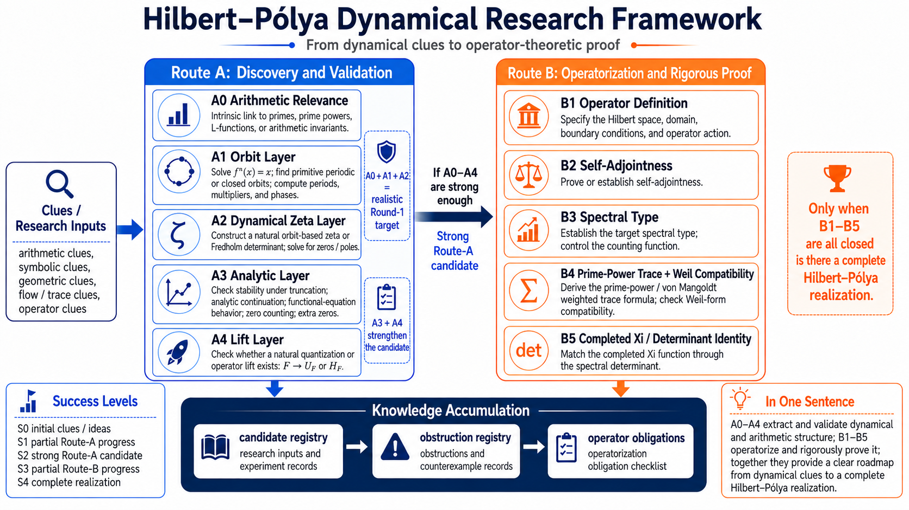

# AI-Guided Exploration of Arithmetic Dynamical Systems: Constraints, Failure Modes, and Search Strategies Toward Hilbert--Pólya Structures

## A Source-Bound, Human-Directed Phase-I Case Study

- **Status:** Internal working-paper draft v0.1
- **Evidence-corpus snapshot:** 419ee36c1e310469209f7b83c096ec8aea448386 (2026-09-13 UTC; the new manuscript itself is not included in this frozen evidence snapshot)
- **Authors and affiliation:** To be supplied by the human authors before external circulation

> **Scope note.** This article is a source-bound synthesis of a first-stage research programme. It reports local mathematical results, diagnostic constructions, negative controls, provenance records, and open proof obligations documented in the cited project materials. It does not claim a proof of the Riemann Hypothesis (RH), a completed Hilbert--Pólya realization, a prime-power trace formula, a completed-\(\Xi\) determinant identity, or a spectral identification of the Riemann zeros.

## Abstract

The search for a Hilbert--Pólya realization has a recurrent methodological difficulty: local features that resemble one part of the desired structure can be mistaken for a continuous proof chain. This paper develops a source-bound, human-directed synthesis of arithmetic-dynamical exploration records and a forward-looking AI-assisted search framework, using the first-stage P1 corpus as a case study. It does not retroactively attribute a uniform AI workflow to every historical research line. The analysis organizes six lines around a common obligation map: arithmetic relevance, primitive-orbit ownership, dynamical zeta or determinant structure, global analytic compatibility, a natural lift, and operator-theoretic closure. It separates four evidence types that are often conflated in exploratory work: source identity, process/provenance records, local mathematical results, and formal Route status. The case record contains constrained operator and trace results, a same-object Fredholm determinant chain, classification and periodic-orbit theorems, finite-system results, negative-transfer theorems, owner obstructions, and positive controls. It also records why none of these results may be aggregated across distinct systems into a Hilbert--Pólya claim. The paper argues that AI assistance is most useful when it supports source navigation, evidence indexing, adversarial comparison, and reproducible documentation under human control of mathematical validation and claim approval. It concludes with a candidate-admission protocol that treats failure modes and stop conditions as reusable search assets rather than discarded negative outcomes.

**Keywords:** arithmetic dynamics; human--AI collaboration; provenance; periodic-orbit ownership; dynamical determinants; Hilbert--Pólya programme

## 中文摘要

Hilbert--Pólya 路线的困难不只在于构造对象，也在于避免把局部相似性误读为完整证明链。本文以 P1 第一阶段语料为案例，讨论一种由人类负责问题界定、数学验收与结论授权，AI 协助检索、索引、关系核查和文档整理的探索框架。文章以 A0--A4 与 B1--B5 为证据义务图，严格分开来源身份、流程记录、局部数学结果和正式路线状态。六条研究线保留了局部算子与迹结构、Fredholm 行列式链、分类与周期结果、有限系统定理、负迁移、所有权障碍及正控制，但没有形成可跨对象拼接的 Hilbert--Pólya 候选。本文的贡献是把这些限制、反例和停止条件转化为下一候选的准入协议，而非把它们包装为 RH 证明或 AI 独立发现的结论。

**关键词：** 算术动力系统；人机协作；来源溯源；本原轨道所有权；动力学行列式；Hilbert--Pólya 计划

## 1. Introduction

The Hilbert--Pólya programme is demanding because its endpoint is not a resemblance between two spectra. A credible realization must bind arithmetic data, periodic dynamics, analytic continuation, and an operator-theoretic trace identity to one mathematical object. A system may have many periodic orbits, a determinant, a self-adjoint operator, or a striking numerical pattern and still fail to supply that chain. The central methodological risk is therefore not merely that a candidate fails. It is that distinct local successes are silently assembled into a candidate that no source actually defines.

The P1 knowledge base was organized to make that risk explicit. It separates an early free-exploration line, zeta_mvp0, from five roadmap-driven Sessions: Logistic Dynamics, Hénon Dynamics, Symplectic Map, Symbolic Dynamics, and Flow Systems. The five P24--P28 continuous-time records are part of Session 5, rather than a seventh top-level direction. The landing page also states that the Wiki is a navigation layer, not a substitute for original manuscripts, source locks, evaluator records, or authorization [P1-KB](../README.md). Its status vocabulary distinguishes source identity, documentation/process state, local mathematics, and Route assessment [P1-CL](../01-status-and-claim-vocabulary.md).

This paper asks a methodological question: how can human researchers use AI assistance to explore arithmetic dynamical candidates while preserving the distinction between a useful clue and a proof obligation? The answer advanced here is deliberately modest. AI-guided work is useful when it reduces navigation and bookkeeping burdens, makes source and object boundaries visible, and helps expose inconsistent transfers. It is not useful when an AI-generated narrative is allowed to replace proof checking, source selection, authorship responsibility, or a formal Route verdict.

The contribution is fourfold. First, the paper interprets the P1 roadmap as an obligation map rather than a progress score. Second, it reconstructs the six lines as an evidence record in which local results, controls, process records, and unresolved states remain distinct. Third, it identifies recurring failure modes, especially the transfer of orbit, determinant, or operator credit across nonidentical objects. Fourth, it formulates a human--AI candidate-admission protocol for a later, separately authorized search. The paper neither reruns the component research nor independently proves its component theorems.

## 2. Method: a source-bound corpus synthesis

### 2.1 Corpus and claim discipline

The analysis is bounded to evidence-corpus snapshot 419ee36c1e310469209f7b83c096ec8aea448386. This locks the source material being synthesized, rather than pretending that the newly written manuscript was already part of the historical corpus. Before any external release, the evidence snapshot and this statement must be refreshed or replaced by a release-specific provenance record. The primary materials include original TeX/PDF manuscripts where available, claim ledgers, evaluation records, source locks, validation receipts, and finalization reports. The P1 Wiki and its Markdown corpus are used for navigation and retrieval only. The corpus generator itself preserves provenance by recording selected canonical TeX candidates and source hashes; a derived full-text Markdown file is not treated as a canonical proof source [P1-META](../meta/README.md).

Each statement in this paper is classified into one of four categories. **L** denotes a local mathematical result with a named object and scope. **C** denotes a control, counterexample, or scoped negative calibration. **P** denotes a provenance or process record, such as a source lock, build, receipt, or internal QA result. **U** denotes an unresolved, unassigned, not-applicable, not-testable, or externally held state. This classification is not a new evaluator. It is a reading discipline derived from the P1 status vocabulary [P1-CL](../01-status-and-claim-vocabulary.md) and is detailed in the accompanying [evidence map](evidence-map.md).

The distinction matters because a completed PDF, a passing build, or a synchronized Git branch is evidence of a particular process event. It is not automatically evidence of mathematical correctness, a Route advance, external peer review, or publication. Conversely, a local theorem may remain valuable even when it does not advance a candidate through the roadmap. This paper treats both outcomes as information, but never as interchangeable information.

### 2.2 What “AI-guided” means here

In this paper, AI-guided does not mean AI-authored mathematics or autonomous proof validation. It names a bounded division of labor. AI assistance may organize a large corpus, convert selected material for reading, trace cross-links, detect inconsistent labels, prepare source maps, compare claim wording against stated boundaries, and help draft a readable synthesis. Human researchers retain authority for selecting the research question, accepting or rejecting a mathematical argument, resolving source conflicts, assigning authorship, approving claims, and deciding whether any result may leave the internal workspace.

This division is particularly important in a programme with heterogeneous objects. In such a corpus, fluent synthesis can create an appearance of continuity even when the source records identify different objects. A repository designed for human--AI collaboration must counter that risk with source locks, object identifiers, explicit nonclaims, and stop conditions. The zeta_mvp0 evidence policy, for example, distinguishes theorem-level, computer-assisted, numerical, and heuristic material and forbids prime tables or zeta-zero arrays from serving as hidden selection input for a claimed endogenous prime carrier [Z0-E](../../zeta_mvp0/docs/EVIDENCE_POLICY.md). The methodological value of such constraints is not that they certify truth automatically. They make the relevant question visible: what exact source, object, and inference license this sentence?

### 2.3 Synthesis procedure and audit trail

The synthesis uses the six top-level P1 directions selected by the knowledge-base index: one early free-exploration programme and the five later roadmap-driven Sessions. It does not count embedded subprojects as independent top-level candidates. For each direction, the drafting workflow starts from the Wiki navigation page and conclusion/roadmap pages, then follows only the named project records for a claim. AI assistance organizes the material, proposes cross-links, extracts status language, and checks the draft against stated nonclaims. A human reviewer checks whether the cited orbit, clock, determinant, and operator belong to the same object, whether the wording matches the source's scope, and whether an inference is authorized.

The resulting audit trail is intentionally inspectable: the [evidence map](evidence-map.md) classifies the permissible use of each source, the project-record table at the end of this manuscript maps each citation key to a local record, and the [citation audit](citation-audit.md) records link and key coverage. These artefacts support traceability; they do not replace proof checking or independently validate the cited mathematics.

### 2.4 A non-transfer rule

The corpus makes one rule especially clear: a conceptual genealogy is not a theorem dependency. Logistic, Hénon, and symplectic work can share a historical motivation; symbolic and flow work can share questions about periodic orbits and determinants. None of those relationships authorizes a Route label, proof, source lock, or operator identity to cross between objects [P1-X](../02-cross-stream-relationships.md). The rest of the paper uses this non-transfer rule as its methodological baseline.

## 3. The obligation map: Route A and Route B

*Figure 1. Programme-level evidence map for the dynamical Hilbert--Pólya search, reproduced from the P1 knowledge base [P1-RM](../rh_roadmap0.png). Route A records discovery and validation obligations from arithmetic relevance to a natural lift; Route B records operator-theoretic obligations from operator definition to prime-power trace and completed-\(\Xi\) closure. The arrows require evidential continuity for one candidate. They are not completed implications, aggregate scores across distinct systems, or a progress chart.*

Figure 1, recorded as P1-RM, organizes the programme into two routes [P1-RM](../rh_roadmap0.png) [P1-CL](../01-status-and-claim-vocabulary.md). Route A begins with arithmetic relevance (A0), then asks for primitive and reproducible periodic-orbit ownership (A1), a stable dynamical zeta or Fredholm determinant (A2), global analytic and Weil-compatible structure (A3), and a natural classical-to-quantum lift (A4). Route B only becomes meaningful when a candidate has a coherent continuation from that chain. It then asks for an operator definition (B1), genuine self-adjointness (B2), the required spectral type (B3), an exact prime-power trace with Weil compatibility (B4), and a global completed-\(\Xi\) determinant or divisor equality (B5).

The crucial word in this description is *same*. The same candidate must carry the arithmetic origin, clock or roof, primitive/repetition rule, normalization, determinant convention, trace regime, and operator owner. A unit-roof symbolic suspension and a physical-roof billiard are not the same object merely because both are describable by symbolic dynamics. A finite-level statistic and an inverse-limit flow are not the same object merely because one is constructed from the other. These same-object examples are source-bound non-transfer constraints, not merely terminological cautions [P1-X](../02-cross-stream-relationships.md) [S5-P](../../flow_systems/BATCH_ROUND9_STAGE5_COMPLETION_REPORT.md).

The continuous-time Flow Systems proposal distributes closely related requirements across its research question and Route sections: arithmetic naturality, a primitive/repetition ledger, zeta/trace analysis, a quantum host, and controls [S5-R](../../flow_systems/propose-flow-systems.md). The candidate card in Section 6 adapts those distributed requirements into a reusable intake design; it does not treat the proposal as a completed validation protocol. This also explains why the roadmap image is not a status chart. The image states what would be needed for a realization; it does not record that any Session has traversed the arrows.

## 4. Phase-I case record

Table 1 is a navigation aid, not a scorecard. Its rows summarize six distinct records whose results must not be added into a single candidate.

| Direction | Object or methodological focus | Preserved Phase-I output | Route stance and reusable constraint |
| --- | --- | --- | --- |
| zeta_mvp0 | Early free exploration of operator, local trace, and arithmetic-clock questions | Local counting, compact-resolvent operator, and certified local relative trace | The endogenous prime-time/zero bridge remains open; local results are not Route-A closure [Z0-C](../../zeta_mvp0/docs/GLOBAL_CLAIM_LEDGER.md). |
| Logistic Dynamics | One frozen polar transfer family at an exact algebraic parameter | Same-object return, roof, nuclear Fredholm determinant, and growth chain | An analytic determinant does not supply Riemann-target arithmetic or quantization; root hunting is stopped for this object [S1-C](../../logistic_dynamics/LOG0001_STABLE_RESULTS.md) [S1-R](../../logistic_dynamics/EXPLORATION_CLOSEOUT.md). |
| Hénon Dynamics | Restricted low- and high-dimensional periodic classifications | Scoped rational/integer, affine-model, and period-spectrum results | Route-A evaluations remain exploratory or negative by the named object; later frozen contracts are not completed papers [S2-S](../../henon_dynamics/research_c424_c428/EVALUATION_SCOPE.md) [S2-E](../../henon_dynamics/research_c424_c428/EVALUATION_ADJUDICATION.md) [S2-HOLD](../../henon_dynamics/research_c429_c433/SESSION_CHECKPOINT_2026-09-10.md). |
| Symplectic Map | Conservative structure, periodic schemes, and qPI interfaces | Five scoped local findings and diagnostic tools | NOT_APPLICABLE is neither a pass nor a failure; no route credit transfers from shared vocabulary [S3-D](../../symplectic_map/docs/research-batch07/BATCH07_FINAL_CROSS_PAPER_DISPOSITION_V1_20260913.md) [S3-E](../../symplectic_map/docs/research-batch07/BATCH07_CROSS_PAPER_SCIENTIFIC_AUDIT_V1_20260913.md). |
| Symbolic Dynamics | Finite autonomous deterministic systems and audit-friendly symbolic structures | Exact-five internal finite-system batch and process artefacts | Internal completion and external hold do not supply geometric, analytic, or operator closure [S4-P](../../symbolic_dynamics/docs/papers211_215_sequence/FINAL_QA_REPORT.md) [S4-ST](../../symbolic_dynamics/SYMBOLIC_DYNAMICS_STATE.md). |
| Flow Systems | Continuous-time orbit, zeta/trace, and quantum-owner stress tests | Local trace/obstruction/control results across P24--P28 | No positive arithmetic A2 or Route-B invocation; ownership cannot move across roof, level, or operator changes [S5-P](../../flow_systems/BATCH_ROUND9_STAGE5_COMPLETION_REPORT.md). |

### 4.1 Early free exploration: zeta_mvp0

The early free-exploration programme supplies a useful baseline because it contains both genuine local structure and a clearly preserved global gap. Its current claim ledger records Q and W counting structures, a fixed self-adjoint operator with compact resolvent, denoted \(S_{\rm op}\), and a certified local relative-trace construction \(P^*_{\rm loc}\) within an explicit local scope [Z0-C](../../zeta_mvp0/docs/GLOBAL_CLAIM_LEDGER.md). These are L-class results in the present taxonomy. They demonstrate that a programme can establish nontrivial operator and trace structure without yet establishing a prime trace or a zero correspondence.

The missing bridge is equally important. The programme roadmap orders its work from clock-preserving operator structure through a certified local trace to an endogenous prime trace, an explicit-formula bridge, and a Hilbert--Pólya synthesis [Z0-R](../../zeta_mvp0/docs/PROGRAMME_ROADMAP.md). Its claim ledger keeps \(P_0\) open: there is no licensed endogenous \(r\log p\) time mechanism with von Mangoldt weights. The zeta-zero spectral correspondence is recorded as unauthorized and not evaluated, and RH is not claimed [Z0-C](../../zeta_mvp0/docs/GLOBAL_CLAIM_LEDGER.md). Thus, a local operator/trace result, including any internal Paper-02 A4.15 label, does not close P1 Route-A A4.

The imported RH archive within this directory provides a second methodological lesson. It is retained as a source-preserving archive, not independently rerun, re-reviewed, or accepted as native zeta_mvp0 evidence [Z0-A](../../zeta_mvp0/rh_import_metadata/PRIME_DYNAMICS_RH_CLAIM_BOUNDARY.md). An AI-assisted system that treats all nearby files as evidence for one programme would erase that boundary. The archive is useful for provenance and reading, but not as a shortcut around the open \(P_0\), zero-correspondence, or RH obligations.

### 4.2 Session 1: Logistic Dynamics

The Logistic line is a strong case of a same-object analytic chain that nevertheless does not become a Riemann-target candidate. At an exact algebraic parameter \(U_c\), the source record preserves physical first-return structure, an invariant ACIP-related description, an intrinsic polar roof, complex inverse branches, a partition and boundary-trace ledger, a nuclear Fredholm determinant, and subsequent growth and order bounds [S1-C](../../logistic_dynamics/LOG0001_STABLE_RESULTS.md). The order of these steps matters: they attach to the same frozen polar transfer family rather than to a collection of unrelated toy models.

Within that object, the analytic Route-A tuple is recorded as A1 weak, A2 analytic determinant, A3 partial analytic structure, and A4 fail. Relative to the Riemann target, the A2--A4 entries are failures, while the line remains exploratory and qualified rather than a completed candidate [S1-C](../../logistic_dynamics/LOG0001_STABLE_RESULTS.md). The difference between those two tuples is a methodological asset. It makes explicit that a Fredholm determinant can be mathematically real and analytically controlled without supplying the arithmetic orbit weights, divisor growth, completed function, or quantization required by the target.

The closeout record turns that result into a search constraint. It parks the existing object, forbids root hunting and Riemann-zero comparison, and identifies a structurally new, explicit, non-Selberg-type countable renewal grammar as a possible future entrance condition [S1-R](../../logistic_dynamics/EXPLORATION_CLOSEOUT.md). This is C- and U-class information, not a verdict on every logistic-like or renewal-like system. The correct reusable lesson is narrower: a later candidate must freeze its clock, function space, determinant convention, and source data before it can be compared with a target.

### 4.3 Session 2: Hénon Dynamics

The Hénon Session implements the low-dimensional versus high-dimensional contrast through restricted mathematical objects rather than through a single HP candidate. C424--C428 contain classifications of rational or integer periodic structures, local--global affine-model results, structured Vieta-recursion channels, and a joint minimal-period spectrum for specified coefficient families. Their conclusions are mathematically useful only with the stated coefficient domains, coordinate choices, clocks, and quantifiers [S2-S](../../henon_dynamics/research_c424_c428/EVALUATION_SCOPE.md).

The formal evaluation is decisive about what those results do not provide. The five records are Route-A exploratory: A0 is a weak arithmetic relation; C426 has A1 fail while the others have A1 weak; A2--A4 fail; and the specified A2 checks include not-testable entries rather than numerical confirmations [S2-E](../../henon_dynamics/research_c424_c428/EVALUATION_ADJUDICATION.md). No Route-B permission follows. This does not discard the classifications. It prevents a reader from turning finite period lists, a good-model classification, or high-dimensional parameterization into a dynamical zeta, a prime mechanism, or a self-adjoint Hilbert--Pólya operator.

The Session also illustrates why document state must not be merged with theorem state. C429--C433 are five admitted and frozen mathematical contracts, but the checkpoint records zero completed papers [S2-HOLD](../../henon_dynamics/research_c429_c433/SESSION_CHECKPOINT_2026-09-10.md). An AI system that sees project identifiers, drafts, or review files and narrates “five new completed results” would manufacture progress. A source-bound workflow preserves both facts: there are potentially valuable authorized contracts, and their final publication/release closure is not part of the Phase-I result record.

### 4.4 Session 3: Symplectic Map

The Symplectic Session asks whether conservative structure, high-dimensional lifting, periodic schemes, and qPI interfaces can sharpen the A0-to-A1 diagnostic. Batch07, P27--P31, records five scoped local mathematical findings: constrained degree transport and reciprocity, word-specific selector/monodromy constructions, a Hénon periodic-cohomology tool, qPI first-jet geometry, and sharp correlation asymptotics on a fixed qPI setting. These are carefully scoped interfaces rather than one combined theorem [S3-D](../../symplectic_map/docs/research-batch07/BATCH07_FINAL_CROSS_PAPER_DISPOSITION_V1_20260913.md).

Their Route status is not “failed” and not “passed.” The Batch07 scientific audit records route applicability as NOT_APPLICABLE [S3-E](../../symplectic_map/docs/research-batch07/BATCH07_CROSS_PAPER_SCIENTIFIC_AUDIT_V1_20260913.md). That label has a positive methodological purpose: it blocks the misleading tendency to recode all mathematical work as a score in a Route-A table. A word-specific map does not become one fixed map that generates arbitrary words. A selector period or weighted-degree construction does not become a spectral eigenvalue or a Riemann spectrum merely because of shared vocabulary. A Hénon cohomology test does not transfer to qPI without a new, object-specific bridge.

The Session’s durable output is thus a diagnostic rule. Its local results do not themselves combine into one Route-A candidate or create a Route-B claim [S3-E](../../symplectic_map/docs/research-batch07/BATCH07_CROSS_PAPER_SCIENTIFIC_AUDIT_V1_20260913.md). In the programme-level roadmap, a later candidate would separately need arithmetic relevance, primitive-orbit ownership, analytic structure, and a natural lift [P1-RM](../rh_roadmap0.png). The route must remain attached to a single candidate, and quantum language cannot rescue an A0/A1 gap.

### 4.5 Session 4: Symbolic Dynamics

The Symbolic Session separates its conceptual roadmap from an internally completed finite-system batch. P211--P215 are five finite autonomous deterministic systems. Their final QA record preserves author and two non-author review evidence, source-only builds, artifact checks, and the exact-five terminal gate [S4-P](../../symbolic_dynamics/docs/papers211_215_sequence/FINAL_QA_REPORT.md). The detailed scope of each individual theorem remains in its own source package rather than being inferred from the batch record.

That record supports two different statements. First, the batch has EXACT_FIVE_INTERNAL_COMPLETE status for the five retained papers. Second, it has HOLD_EXTERNAL status and confers no automatic A0--A4 credit, Route-B entry, global trace formula, or RH component [S4-P](../../symbolic_dynamics/docs/papers211_215_sequence/FINAL_QA_REPORT.md) [S4-ST](../../symbolic_dynamics/SYMBOLIC_DYNAMICS_STATE.md) [P1-CL](../01-status-and-claim-vocabulary.md). The current state record likewise preserves a paused, internally synchronized status rather than an external scientific verdict.

For a human--AI workflow, this is a valuable practical example. Finite symbolic systems can provide an audit-friendly setting for local theorems and artifacts. They cannot silently acquire a geometric carrier, primitive-orbit ownership, global analytic continuation, or an operator realization by virtue of a clean pipeline. The productive output is a list of missing obligations and a model for preserving proof, code, review, and build boundaries together.

### 4.6 Session 5: Flow Systems

The Flow Systems line puts the Route-A and Route-B language under its most explicit continuous-time pressure. Its proposal asks whether continuous-time flows can provide the periodic-orbit, action, phase, trace, and quantization structures required by an arithmetic Hilbert--Pólya candidate [S5-R](../../flow_systems/propose-flow-systems.md). Across the Phase-I records, the recurring methodological question is ownership: does the same flow own the time, orbit family, repetition law, determinant, trace contribution, and operator? This paper uses that question as a synthesis lens rather than claiming that the proposal itself resolves it.

P24--P28 make the point in several complementary ways. P24 gives a general principal-congruence trace identity and first-jet laws, while its frozen proxy retains weak A0/A1 and fails later entries; the complete Bianchi flow itself remains unassigned. P25 proves that a unit-roof symbolic determinant does not transfer to the physical three-disk flight-length flow. P26 supplies a finite owner taxonomy and paired negative controls that support a bounded nonfactorization conclusion rather than a global primitive Euler owner. P27 proves an inverse-limit obstruction and prevents finite-level data from borrowing closed-orbit credit for the limit flow. P28 supplies exact nonarithmetic Bolza control results while the record leaves any magnetic/arithmetic transfer unclaimed.

The batch report is unusually clear about the aggregate boundary: positive arithmetic A2 is 0/5, Route-B invocation is 0/5, and the completed process does not generate new Gates A--E credit [S5-P](../../flow_systems/BATCH_ROUND9_STAGE5_COMPLETION_REPORT.md). Its Stage-6 receipt records that the pipelines are complete because Stage 6 was explicitly skipped; scientific content and Route status remain unchanged [S5-END](../../flow_systems/BATCH_ROUND9_STAGE6_SKIP_RECEIPT.json). These P-class facts must not be treated as a scientific failure of all flows, but within this source-bound record they rule out a narrative in which five finished papers amount to a completed Hilbert--Pólya candidate.

The Flow line also supplies the strongest cross-stream methodological lesson. A determinant is not portable from a symbolic calibrator to a physical system. A finite-level trace may not be attributed to an inverse-limit flow without a same-object proof. These examples enact the general P1 non-transfer rule rather than establishing a global theorem about all operators [S5-P](../../flow_systems/BATCH_ROUND9_STAGE5_COMPLETION_REPORT.md) [P1-X](../02-cross-stream-relationships.md). Such boundaries are not administrative caution; they are mathematical requirements for avoiding false joins.

## 5. Constraints and failure modes as research outputs

The negative and non-terminal records above should not be compressed into the informal statement that “the approaches failed.” That phrase loses the object, the scope, and the informative content of the outcome. Phase I instead produces a catalogue of constraints. A constraint says that, for a named object under a named convention, a proposed inference is unavailable, a transfer is invalid, an admissible test is not yet meaningful, or a required owner is missing. It may close a route for that object while leaving neighboring mathematical questions open.

### 5.1 Five recurrent failure modes

The first failure mode is **arithmetic-source absence**. A system may have exact periodic points, rich symbolic coding, or a well-behaved transfer operator without an endogenous rule that selects prime powers and supplies their \(r\log p\)-type timing or von Mangoldt weighting. The zeta_mvp0 ledger leaves this bridge open, while the Logistic record makes a comparable target gap visible in its own setting [Z0-C](../../zeta_mvp0/docs/GLOBAL_CLAIM_LEDGER.md) [S1-C](../../logistic_dynamics/LOG0001_STABLE_RESULTS.md). This is not repaired by fitting a numerical spectrum after the fact. Symplectic route inapplicability is a different, non-transfer classification rather than evidence of the same arithmetic-source absence [S3-E](../../symplectic_map/docs/research-batch07/BATCH07_CROSS_PAPER_SCIENTIFIC_AUDIT_V1_20260913.md).

The second is **object mismatch**. A theorem about a unit-roof symbolic suspension does not establish the corresponding assertion for a physical-roof flow; a result at finite level does not automatically hold in an inverse limit; and an operator on one realization does not automatically own the determinant attached to another. P25 and P27 make these distinctions especially concrete in the flow corpus [S5-P](../../flow_systems/BATCH_ROUND9_STAGE5_COMPLETION_REPORT.md). The correct response is not to blur the models into one narrative, but to record an explicit non-transfer boundary and identify what a new proof would have to bridge.

The third is **analytic insufficiency**. A Fredholm determinant, a growth estimate, or a trace germ can be a genuine local contribution while still falling short of a global target determinant, a Weil-compatible trace formula, or the divisor identity for completed \(\Xi\). The Logistic record makes this separation explicit through different analytics and Riemann-target tuples [S1-C](../../logistic_dynamics/LOG0001_STABLE_RESULTS.md). The distinction protects both sides: it avoids dismissing an analytic theorem merely because it is not a proof of RH, and avoids promoting it into a theorem it does not state.

The fourth is **status inflation**. A frozen contract, internal review, passing build, finished batch, or synchronized repository is a valuable reproducibility fact. It is not a substitute for a theorem, an evaluator verdict, an external review, or a Route advance. The Hénon and Symbolic records give complementary examples: admitted contracts may remain incomplete, while exact internal completion may remain externally held and route-neutral [S2-HOLD](../../henon_dynamics/research_c429_c433/SESSION_CHECKPOINT_2026-09-10.md) [S4-P](../../symbolic_dynamics/docs/papers211_215_sequence/FINAL_QA_REPORT.md). A corpus synthesis must guard against this failure because project labels and polished prose can look like semantic closure.

The fifth is **automation overreach**. Corpus retrieval can find similar notation; a language model can state a plausible bridge; a numerical script can expose a pattern. None supplies the mathematical license for a conclusion. The Phase-I discipline therefore treats automation as an aid to attention, comparison, and documentation rather than as an authority that can infer a proof, upgrade a source, or decide that a gap has disappeared. The evidence policy in the free-exploration line makes the point operational by distinguishing theorem-level, computer-assisted, numerical, and heuristic material [Z0-E](../../zeta_mvp0/docs/EVIDENCE_POLICY.md).

### 5.2 Why a scoped negative result is useful

A useful negative result has four elements: a fixed object, a fixed question, an explicit admissible comparison class, and an exact conclusion. It is not a general claim that an entire research direction is impossible. P26's bounded nonfactorization outcome, P27's inverse-limit obstruction, and the route-neutral Symplectic audit are valuable precisely because their scope is retained [S5-P](../../flow_systems/BATCH_ROUND9_STAGE5_COMPLETION_REPORT.md) [S3-E](../../symplectic_map/docs/research-batch07/BATCH07_CROSS_PAPER_SCIENTIFIC_AUDIT_V1_20260913.md).

This changes how an exploratory programme measures progress. A local theorem, a carefully delimited counterexample, a failed gate with a diagnosis, and a reproducible no-transfer rule can each reduce the search space. What must be resisted is turning their aggregate number into a surrogate proof score. There is no additive accounting in which five partial analytic facts, five completed internal papers, or five different operators become one realization. This paper therefore treats the roadmap's linked obligations as non-compensatory [P1-RM](../rh_roadmap0.png).

### 5.3 A two-layer account of the case study

The original lines in the corpus were created under their own mathematical and project protocols. This paper does not retroactively claim that they all used a single AI procedure. Rather, it adds a second, reproducible layer: a human-directed AI-assisted synthesis that navigates the records, preserves source identity, applies a declared vocabulary, and exposes cross-stream boundaries. The distinction is essential for historical accuracy.

At this second layer, AI can accelerate retrieval and comparison across a corpus that is too heterogeneous to summarize safely from memory. The human contribution is not ceremonial. Humans decide whether a statement describes the source faithfully, whether a proposed comparison concerns the same object, whether a mathematical argument is valid, and whether the wording is fit for release. The desired result is a collaboration in which AI makes overlooked constraints easier to see and human judgment makes unsupported continuity harder to write.

## 6. A search strategy for the next candidate

The Phase-I record suggests that later work should begin with a candidate specification rather than with target matching. The purpose is not to make exploration bureaucratic. It is to place low-cost disqualifying tests before expensive operator construction, numerical experimentation, or narrative polishing.

### 6.1 The candidate card

Every proposed candidate should receive a compact, versioned candidate card before a Route label is discussed. The card should identify the following fields.

| Field | Required question | Early stop condition |
| --- | --- | --- |
| Object identity | What exact phase space, map or flow, parameter regime, and measure are under study? | The object changes between orbit, determinant, and operator sections. |
| Arithmetic origin | What internal mechanism supplies the relevant arithmetic data? | Prime, zero, or target data are inserted as an external selector rather than arising from the claimed carrier [Z0-E](../../zeta_mvp0/docs/EVIDENCE_POLICY.md). |
| Clock and repetition | What fixes period, roof, action, primitive orbit, and repetition multiplicity? | A symbolic or unit-roof clock is substituted for a distinct physical clock without proof. |
| Analytic owner | Which transfer operator, zeta, determinant, domain, and normalization belong to this same object? | The claimed analytic object is borrowed from a calibrator or an unrelated model. |
| Controls | Which positive controls, negative controls, and invariance tests can falsify the proposed bridge? | No comparison could distinguish a genuine mechanism from a fitted coincidence. |
| Operator owner | Which Hilbert space, operator, domain, boundary conditions, and symmetry give the quantum candidate? | Self-adjointness or spectrum is asserted without a fixed operator/domain pair. |
| Route decision | Which exact gate has evidence, which is open, and which is inapplicable? | A label is inferred from adjacent work rather than direct evidence. |

The card adapts the Flow proposal's distributed requirements into a reusable intake device: phase space, generator, clock, primitive objects, repetition law, arithmetic source, analytic object, and controls [S5-R](../../flow_systems/propose-flow-systems.md). These fields are a design contribution of this synthesis, not a claim that the proposal itself prescribed the exact table or that every field was historically fixed before target comparison. The same format also keeps free exploration honest. A promising local operator can be pursued as local analysis without being mislabeled as a Hilbert--Pólya candidate.

### 6.2 A staged human--AI loop

The following loop is a practical framework for later exploration.

1. **Human-framed intake.** A human researcher states the candidate, the mathematical question, the permitted source data, and the strongest claim that would be scientifically meaningful. AI may help turn this into a candidate card, but may not choose an unannounced target or import prohibited prime/zero data as a hidden carrier-selection input [Z0-E](../../zeta_mvp0/docs/EVIDENCE_POLICY.md).

2. **Source-grounded object audit.** AI retrieves the relevant definitions, prior results, and likely near-miss analogies. A human checks that orbit, roof, determinant, and operator references concern the same object. Any mismatch becomes a named issue rather than a prose footnote.

3. **Adversarial controls before optimization.** The team constructs nearby controls that preserve a superficial feature while breaking the proposed mechanism: a changed roof, a finite-level approximation, a nonarithmetic analogue, a different boundary condition, or an owner mismatch. The Flow record documents such controls, while the Logistic closeout halts root hunting and Riemann-zero comparison for its existing object; together they motivate this intake procedure before a new round of target fitting [S1-R](../../logistic_dynamics/EXPLORATION_CLOSEOUT.md) [S5-P](../../flow_systems/BATCH_ROUND9_STAGE5_COMPLETION_REPORT.md).

4. **Local proof and reproducibility work.** Once the object survives basic ownership checks, mathematical arguments, certified computation, and source-locked artifacts can be developed. AI can identify omitted hypotheses, enumerate dependent claims, and generate review checklists. It cannot certify the proof; the human author or designated mathematical reviewer must do that.

5. **Gate-by-gate adjudication.** A candidate advances only when evidence addresses the next gate on that candidate card. Open, not-testable, unassigned, and not-applicable states remain first-class results. No aggregate score is calculated across Sessions.

6. **Stop, archive, or fork.** If a necessary owner or arithmetic mechanism is absent, the current route is stopped with a short negative record. A genuinely new model receives a new card and new source identity. This preserves useful local work while preventing a failed object from being cosmetically relaunched under a nearby name.

This loop is deliberately asymmetric. AI is allowed to propose comparisons, find contradictions, and draft explanations; it is not allowed to silently upgrade source status or make the final mathematical decision. Humans are accountable for the hard judgments: proof validity, authorization, scientific relevance, claim acceptance, and external dissemination.

### 6.3 Route B as a no-shortcut discipline

Route B should be treated as linked obligations, not a prestige label for any self-adjoint-looking construction. Before an operator result is connected to RH, the candidate card must show that the same object owns its arithmetic periodic-orbit data and analytic object. The applicable formal evaluator must close all B1--B5 obligations for that same candidate: a defined operator and domain, genuine self-adjointness, the required spectral type, an exact prime-power/Weil-compatible trace identity, and a global completed-\(\Xi\) determinant or divisor equality [P1-RM](../rh_roadmap0.png) [P1-CL](../01-status-and-claim-vocabulary.md).

The practical benefit is early clarity. A self-adjoint construction, a compact-resolvent local operator, or a numerical spectrum can remain a worthwhile object of study. It simply does not receive an implication it has not earned. This is more demanding than a success narrative, but it makes a later positive claim substantially more legible and falsifiable.

## 7. Limitations, governance, and conclusion

This paper is a source-bound working paper, not an external literature review, a bibliometric study, a benchmark of AI theorem proving, or an independent replication of every mathematical result named in the corpus. It does not establish RH, construct a Hilbert--Pólya operator, derive an endogenous prime-power trace, prove a completed-\(\Xi\) determinant equality, or identify the nontrivial Riemann zeros with a spectrum. It also makes no claim about the resolution of any other major open problem. The appropriate use of the paper is therefore as a navigable research asset and a disciplined design document for subsequent, separately evaluated work.

There are additional limitations. The selected snapshot contains historical documents with different levels of theorem maturity, review, and public-release status. Some results are represented here through final ledgers or audits rather than rederived proofs. The roadmap itself is a programme design, not a universal theorem about all dynamical systems. And the human--AI framework described here has not yet been evaluated through a controlled comparison against other research workflows. These limitations do not make the record unhelpful; they define the interpretation it can support.

Within those limits, the central conclusion is constructive. The six lines do not merge into an unfinished proof. They form a set of tested constraints on how a credible arithmetic dynamical candidate would have to be built and audited. The early free exploration preserves local operator and trace structure while keeping its prime bridge open. The five roadmap Sessions contribute controlled examples of analytic insufficiency, dimensional and model dependence, route inapplicability, process-versus-theorem separation, and ownership failures in continuous-time systems. Together they show that the next search should privilege source identity, same-object continuity, adversarial controls, early stop conditions, and explicit human authorization over numerical resemblance or retrospective storytelling.

For an AI-guided research programme, this is a substantive result. The role of AI is to widen the field of attention without widening the claim beyond its evidence. The role of the human researcher is to decide what counts as the same object, what constitutes a proof, and when an attractive bridge must remain an open problem. If a later candidate survives that discipline, its eventual positive result will be easier to evaluate. If it does not, the negative record will still make the next search more precise.

## Research-material, governance, and AI-use statements

### Research materials and provenance

This manuscript is a documentation and synthesis artifact over the evidence-corpus snapshot named in Section 2. It introduces no new experimental dataset and makes no claim that its prose replaces the canonical TeX/PDF sources, claim ledgers, audits, or receipts. The P1 Wiki is the entry point to the six-direction corpus [P1-KB](../README.md).

### Human oversight and use of AI assistance

AI assistance was used for corpus navigation, source mapping, consistency-oriented drafting, and review-checklist preparation. Human direction is required for corpus selection, mathematical interpretation, approval of every claim, authorship, and any decision to circulate the manuscript outside the workspace. AI assistance did not independently validate a theorem or supply an authority for an unverified mathematical conclusion.

### Authorship, funding, and competing interests

Author list, affiliation, funding information, and any competing-interest declaration are intentionally left for the responsible human authors before external circulation. This internal draft should not be submitted or represented as externally peer reviewed in its current state.

## Project records cited in this manuscript

The following are repository records, not a conventional external bibliography. Each key identifies the exact local source used for the associated statement.

| Key | Project record | Role in this manuscript |
| --- | --- | --- |
| P1-RM | [P1 roadmap image](../rh_roadmap0.png) | Programme obligation map and Route-A/Route-B wording |
| P1-KB | [P1 Wiki index](../README.md) | Six-direction corpus navigation and provenance |
| P1-CL | [Claim vocabulary](../01-status-and-claim-vocabulary.md) | Status and claim-class discipline |
| P1-META | [Corpus metadata](../meta/README.md) | Derived-corpus provenance boundary |
| P1-X | [Cross-stream relationships](../02-cross-stream-relationships.md) | Non-transfer rule |
| Z0-E | [zeta_mvp0 evidence policy](../../zeta_mvp0/docs/EVIDENCE_POLICY.md) | Evidence-class and target-data constraints |
| Z0-C | [zeta_mvp0 global claim ledger](../../zeta_mvp0/docs/GLOBAL_CLAIM_LEDGER.md) | Local results and open global bridge |
| Z0-R | [zeta_mvp0 programme roadmap](../../zeta_mvp0/docs/PROGRAMME_ROADMAP.md) | Ordered free-exploration programme |
| Z0-A | [Imported-RH claim boundary](../../zeta_mvp0/rh_import_metadata/PRIME_DYNAMICS_RH_CLAIM_BOUNDARY.md) | Archive provenance and non-transfer boundary |
| S1-C | [Logistic stable results](../../logistic_dynamics/LOG0001_STABLE_RESULTS.md) | Same-object analytic chain and tuples |
| S1-R | [Logistic closeout](../../logistic_dynamics/EXPLORATION_CLOSEOUT.md) | Stop conditions and future entrance rule |
| S2-S | [Hénon evaluation scope](../../henon_dynamics/research_c424_c428/EVALUATION_SCOPE.md) | Exact object, clock, theorem scope, and target boundary |
| S2-E | [Hénon evaluation adjudication](../../henon_dynamics/research_c424_c428/EVALUATION_ADJUDICATION.md) | Restricted results and Route-A limitations |
| S2-HOLD | [Hénon session checkpoint](../../henon_dynamics/research_c429_c433/SESSION_CHECKPOINT_2026-09-10.md) | Admitted-contract versus completed-paper distinction |
| S3-D | [Symplectic Batch07 disposition](../../symplectic_map/docs/research-batch07/BATCH07_FINAL_CROSS_PAPER_DISPOSITION_V1_20260913.md) | Five scoped local findings |
| S3-E | [Symplectic Batch07 audit](../../symplectic_map/docs/research-batch07/BATCH07_CROSS_PAPER_SCIENTIFIC_AUDIT_V1_20260913.md) | NOT_APPLICABLE route boundary |
| S4-P | [Symbolic final QA report](../../symbolic_dynamics/docs/papers211_215_sequence/FINAL_QA_REPORT.md) | Exact-five internal completion and external hold |
| S4-ST | [Symbolic state record](../../symbolic_dynamics/SYMBOLIC_DYNAMICS_STATE.md) | Paused/synchronized status boundary |
| S5-R | [Flow Systems proposal](../../flow_systems/propose-flow-systems.md) | Candidate identity and Route-A intake requirements |
| S5-P | [Flow round-9 completion report](../../flow_systems/BATCH_ROUND9_STAGE5_COMPLETION_REPORT.md) | P24--P28 controls and aggregate boundary |
| S5-END | [Flow Stage-6 skip receipt](../../flow_systems/BATCH_ROUND9_STAGE6_SKIP_RECEIPT.json) | Process completion without scientific/Route change |
